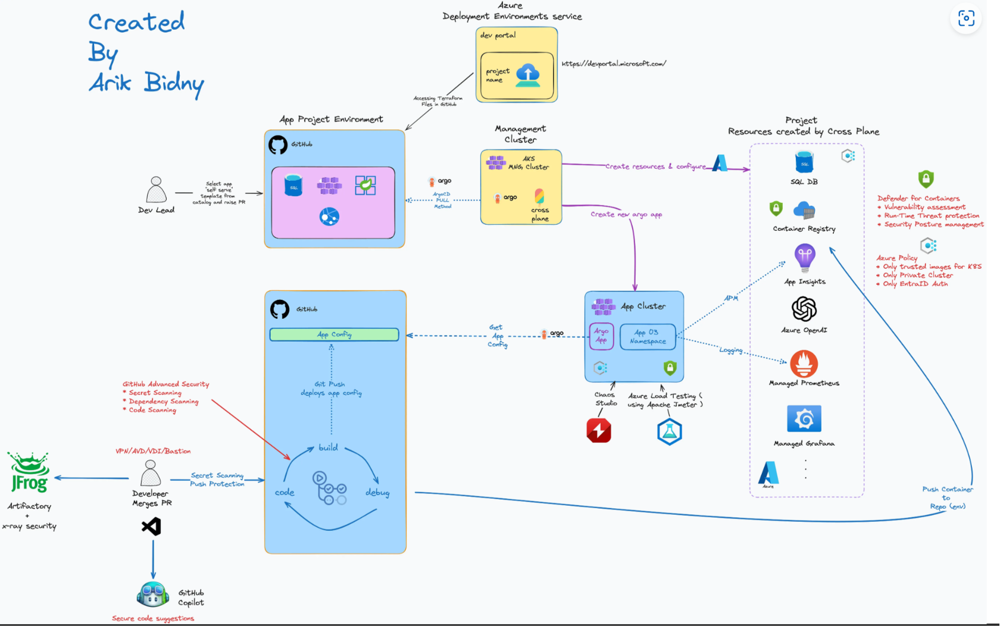

# Deploy and Configure ArgoCD and Crossplane on AKS

## Introduction
This project provides an automated and declarative approach to managing Kubernetes clusters with GitOps principles using ArgoCD and Crossplane. It leverages the App of Apps pattern for scalable and reusable deployment configurations and introduces Crossplane for cloud infrastructure orchestration.

ArgoCD is employed as the GitOps tool to manage and deploy Kubernetes manifests declaratively. Crossplane extends Kubernetes functionality by enabling infrastructure management via Kubernetes APIs.


> **Credit:**
> This architecture was designed by [Arik Bidny](https://www.linkedin.com/in/arik-bidny).

---

## Architecture Overview
The repository implements a multi-layered architecture, facilitating a clear separation between cluster management and workload deployment. Key components include:

1. **AKS Automatic**: The management cluster is hosted on Azure Kubernetes Service (AKS), benefiting from Azure's managed Kubernetes features, including automatic updates, scaling, and enhanced security. This ensures reliability and reduces operational overhead. Learn more about AKS Automatic [here](https://learn.microsoft.com/en-us/azure/aks/intro-aks-automatic).
2. **Management Cluster**: A Kubernetes cluster hosting ArgoCD and Crossplane.
3. **ArgoCD**: Installed in the management cluster, responsible for syncing configurations from a Git repository.
4. **Crossplane**: Installed and managed via ArgoCD, used for provisioning cloud resources (e.g., Azure).
5. **GitOps Workflow**: Declarative application management leveraging ArgoCD's automated sync capabilities.
6. **App of Apps Pattern**: A hierarchical deployment strategy for managing complex application dependencies.

---

## Repository Structure
### `argocd/install`
This directory contains manifests to install ArgoCD on the management cluster. It includes:

1. **Base Install Files**: YAML manifests required for deploying ArgoCD components (server, repo-server, and controller).
2. **Namespace Definition**: Ensures that the `argocd` namespace is created before deploying the components.
3. **Kustomization**: A `kustomization.yaml` file that simplifies managing, customizing, and deploying ArgoCD manifests.

To install ArgoCD:
```bash
kubectl apply -k argocd/install
```

> **Note:** Ensure that the namespace is applied first if not already present.

### `argocd/crossplane-bootstrap`
This directory includes configuration for deploying Crossplane and its dependencies. We will dive into this in detail later in this guide.

---

## AKS Management Cluster Setup
To create an AKS cluster, use the following command:
```bash
az aks create --resource-group <resource-group-name> --name <cluster-name> --node-count <node-count> --enable-addons monitoring --generate-ssh-keys
```
For more details on AKS Automatic, refer to the [Azure documentation](https://learn.microsoft.com/en-us/azure/aks/intro-aks-automatic).

#### 1. Access AKS Credentials
Obtain credentials for the AKS cluster:

```bash
az aks get-credentials --name <cluster-name> --resource-group <resource-group-name>
```

Example:
```bash
az aks get-credentials --name orrocrspln-aks --resource-group env-orrocrspln-31-1737614754-rg
```

#### 2. Deploy ArgoCD
Install ArgoCD on the management cluster:
```bash
kubectl apply -k argocd/install
```

Patch the `argocd-server` service to be of type `LoadBalancer`:
```bash
kubectl patch svc argocd-server -n argocd -p '{"spec": {"type": "LoadBalancer"}}'
```

Retrieve the external IP of the ArgoCD server:
```bash
kubectl get svc argocd-server -n argocd -o jsonpath='{.status.loadBalancer.ingress[0].ip}'
```

#### 3. Login to ArgoCD CLI
Retrieve the initial admin password and log in to the ArgoCD CLI:
```bash
argocd login $(kubectl get svc argocd-server -n argocd -o jsonpath='{.status.loadBalancer.ingress[0].ip}') --username admin --password $(kubectl -n argocd get secret argocd-initial-admin-secret -o jsonpath='{.data.password}' | base64 -d; echo) --insecure
```

---

## Install Crossplane on Management Cluster with ArgoCD
Configuring Crossplane with ArgoCD aligns with our GitOps strategy by enabling declarative, automated, and consistent infrastructure management. By managing Crossplane via ArgoCD, we integrate infrastructure provisioning into the same pipeline used for application deployments, reducing complexity and ensuring synchronization between workloads and resources.

ArgoCD's GitOps model ensures:
- Automated reconciliation of infrastructure state based on Git commits.
- Standardized resource management across environments.
- Support for version control and audit trails for all changes.

### Steps to Configure Crossplane with ArgoCD

#### 1. Create a Secret for the Non-Standard Helm Chart Repository
This Helm chart needs to be picked up by Argo in a declarative GitOps way. As this is a non-standard Helm Chart, we need to define a Secret:

```bash
kubectl apply -f argocd/crossplane-bootstrap/crossplane-helm-secret.yaml
```

#### 2. Deploy the Crossplane Helm Chart
Using ArgoCD, define the application manifest to deploy the Crossplane Helm Chart:

```bash
kubectl apply -n argocd -f argocd/crossplane-bootstrap/crossplane.yaml
```

> **Note:**
> - This configuration sets up Crossplane core components to be automatically pruned by ArgoCD.
> - The configuration includes `syncOptions: - CreateNamespace=true` to automatically create the `crossplane-system` namespace.
> - See ArgoCD's [documentation](https://argo-cd.readthedocs.io/en/stable/operator-manual/declarative-setup/#crossplane-bootstrap) for more details.

#### 3. Create Azure Credentials and Azure Provider Secret
Follow the Crossplane documentation to create Azure credentials:

```bash
az ad sp create-for-rbac --sdk-auth --role Owner --scopes /subscriptions/<subscription-id> > azure-credentials.json
```

Create a Kubernetes secret with the credentials:

```bash
kubectl create secret generic azure-secret -n crossplane-system --from-file=creds=./azure-credentials.json
```

#### 4. Install Crossplane's Azure Provider with ArgoCD
Deploy the Azure provider for Crossplane:
```bash
kubectl apply -f argocd/crossplane-bootstrap/crossplane-provider-azure.yaml
```

This configuration ensures that:
- Child applications are automatically created, synced, and deleted when manifests are updated.
- The `resources-finalizer.argocd.argoproj.io` finalizer is applied for proper cascading deletes ([documentation here](https://argo-cd.readthedocs.io/en/stable/user-guide/auto_sync/#automatic-pruning)).

#### 5. Install Crossplane's Azure ProviderConfig with ArgoCD
The ProviderConfig defines how Crossplane connects to Azure services by referencing the credentials secret. Deploy the ProviderConfig:

```bash
kubectl apply -f argocd/crossplane-bootstrap/crossplane-provider-azure-config.yaml
```

> **Note:**
> - The `ProviderConfig` defaults to `default` unless otherwise specified.
> - Ensure the `secretRef.name` and `secretRef.key` match the previously created secret.

---

## Crossplane XRD and Composition
Crossplane uses two key components to enable Kubernetes-native infrastructure provisioning: **Composite Resource Definitions (XRDs)** and **Compositions**.

### Composite Resource Definitions (XRDs)
An XRD is a schema that defines a new composite resource type in Kubernetes. It abstracts complex infrastructure configurations into a single Kubernetes object that developers can use. Learn more about XRDs [here](https://docs.crossplane.io/latest/concepts/composite-resource-definitions/).

#### In Our Case
The `argocd/config/xrd` directory defines a custom **DevEnvironment XRD**:
- This XRD encapsulates components like compute, networking, and Azure OpenAI resources, providing developers with an environment identical to production for testing features or fixing bugs.
- Developers can request environments by applying simple YAML files without knowing the underlying infrastructure configurations.

This approach simplifies the provisioning process, allowing developers to focus on innovation rather than infrastructure.

Commands to view deployed XRDs:
```bash
kubectl get xrd -n crossplane-system
kubectl describe xrd <xrd-name> -n crossplane-system
```

### Compositions
A Composition maps an XRD to underlying managed resources, specifying how the composite resource should be provisioned in the cloud. Compositions enable platform engineers to define reusable and standardized templates for infrastructure setups. Learn more about Compositions [here](https://docs.crossplane.io/latest/concepts/compositions/).

#### Composition Revisions
Composition Revisions provide versioning and immutability for Compositions, allowing updates without affecting existing resources. Learn more about Composition Revisions [here](https://docs.crossplane.io/latest/concepts/composition-revisions/).

#### In Our Case
The `argocd/config/composition` directory contains the **DevEnvironment Composition**:
- This Composition maps the DevEnvironment XRD to Azure resources like virtual networks, subnets, storage accounts, and Azure OpenAI instances.
- Platform engineers can update or add Compositions, which are automatically deployed and tracked via ArgoCD.

Commands to view deployed Compositions and their revisions:
```bash
kubectl get composition -n crossplane-system
kubectl describe composition <composition-name> -n crossplane-system
kubectl get compositionrevision -n crossplane-system
```

### Automating XRD and Composition Deployment
To support our strategy, the `argocd/crossplane-bootstrap` directory includes ArgoCD applications configured to monitor the `xrd` and `composition` directories. This setup ensures:
- New or updated XRDs and Compositions are automatically deployed to the cluster.
- All changes are tracked in Git, maintaining consistency and visibility.

Example deployment commands:
```bash
kubectl apply -f argocd/config/xrd/dev-environment.yaml
kubectl apply -f argocd/config/composition/dev-environment-composition.yaml
```

Once both set up, This is how the YAML for provisioning a DevEnvironment will look like:
```yaml
apiVersion: dev.azure.upbound.io/v1alpha1
kind: DevEnvironment
metadata:
  name: stark-tower-env-eastus-456
spec:
  parameters:
    region: eastus
    resourceGroup: avengers-resource-group
    developer: tony-stark
    issueId: "456"
    storageAccountName: starkindustries456re
```

---

## App of Apps Pattern
The App of Apps pattern is a powerful method to manage and synchronize multiple interdependent ArgoCD applications. This pattern enables a hierarchical approach to deploying applications, consolidating dependencies and infrastructure configurations into a single cohesive workflow.

In this repository, the **App of Apps** pattern is implemented through the `argocd/crossplane-bootstrap.yaml` file, which acts as the single entry point for deploying and managing all resources defined in the project. By applying this single file, you orchestrate the deployment of Crossplane, XRDs, Compositions, and other supporting applications. 

### How It Works
The `argocd/crossplane-bootstrap.yaml` file defines parent applications that reference and deploy child applications in a hierarchical manner. Each child application manages specific components, such as:

- **Crossplane Installation**: Deploying Crossplane core components and providers.
- **XRDs and Compositions**: Monitoring and deploying reusable infrastructure templates for developer environments.
- **Provider Configuration**: Configuring credentials and connection details for Azure.

This structure aligns with GitOps principles by:
- **Tracking Changes**: Updates to any component are reflected in Git, ensuring full traceability and auditability.

- **Simplifying Dependency Management**: All configurations and dependencies are managed centrally and applied automatically, within these directotries:
    - [`argocd/crossplane-bootstrap/`](argocd/crossplane-bootstrap/)
        - Contains configurations for deploying Crossplane and its dependencies using ArgoCD.
    - [`argocd/config/xrd/`](argocd/config/xrd/)
        - Defines custom Composite Resource Definitions (XRDs) for Crossplane.
    - [`argocd/config/composition/`](argocd/config/composition/)
        - Contains Compositions that map XRDs to underlying managed resources.
    - [`upbound/provider-azure/config/`](upbound/provider-azure/config/)
        - Holds configuration files for the Azure provider used by Crossplane.
    - [`upbound/provider-azure/provider/`](upbound/provider-azure/provider/)
        - Contains the provider-specific configurations and credentials for Azure.
    - [`infrastructure/azure/dev-envs`](infrastructure/azure/dev-envs)
        - Manages the infrastructure setup for development environments on Azure.

- **Streamlining Deployment**: Developers and platform engineers can apply a single manifest to deploy or update the entire stack:

```bash
kubectl apply -f argocd/crossplane-bootstrap.yaml
```

### Benefits
1. **Consistency**: Ensures that all applications and configurations are deployed in the correct order and remain synchronized.
2. **Scalability**: Enables managing complex dependencies across multiple applications.
3. **Modularity**: Allows for easy updates and additions to specific components without affecting the entire stack.

By using the **App of Apps** pattern, this repository provides a unified, scalable, and maintainable approach to managing Kubernetes-based infrastructure and applications.


---

## Deployment Workflow

1. Install ArgoCD on the management cluster.
2. Configure ArgoCD for GitOps:
   - Create secrets for custom Helm repositories.
   - Deploy Crossplane and its components via ArgoCD applications.
3. Leverage the App of Apps pattern for modular and reusable configurations.
4. Utilize Crossplane to provision and manage Azure cloud resources declaratively.
5. Implement XRDs and Compositions for custom resource definitions and mappings.
6. Monitor and troubleshoot applications using ArgoCD's user interface.

---

## Notes from the Platform Engineering Report
The implementation aligns with key trends highlighted in the "State of Platform Engineering Report Vol. 3," such as:

1. **Platform Orchestration**: Leveraging Crossplane as the orchestrator for infrastructure resources.
2. **App of Apps**: Facilitating scalable platform adoption through hierarchical deployments.
3. **Automation and Standardization**: Enabling GitOps principles to reduce manual configuration errors and improve consistency.
4. **Infrastructure and DevEx Balance**: Supporting both infrastructure provisioning and enhanced developer experience through declarative pipelines.

---

## Key References
- [Crossplane Documentation](https://docs.crossplane.io/)
- [ArgoCD Documentation](https://argo-cd.readthedocs.io/)
- [State of Platform Engineering Report](https://platformengineering.org/report)

---

This repository serves as a foundational template for implementing GitOps practices using ArgoCD and Crossplane for Kubernetes-based infrastructure and application management.
